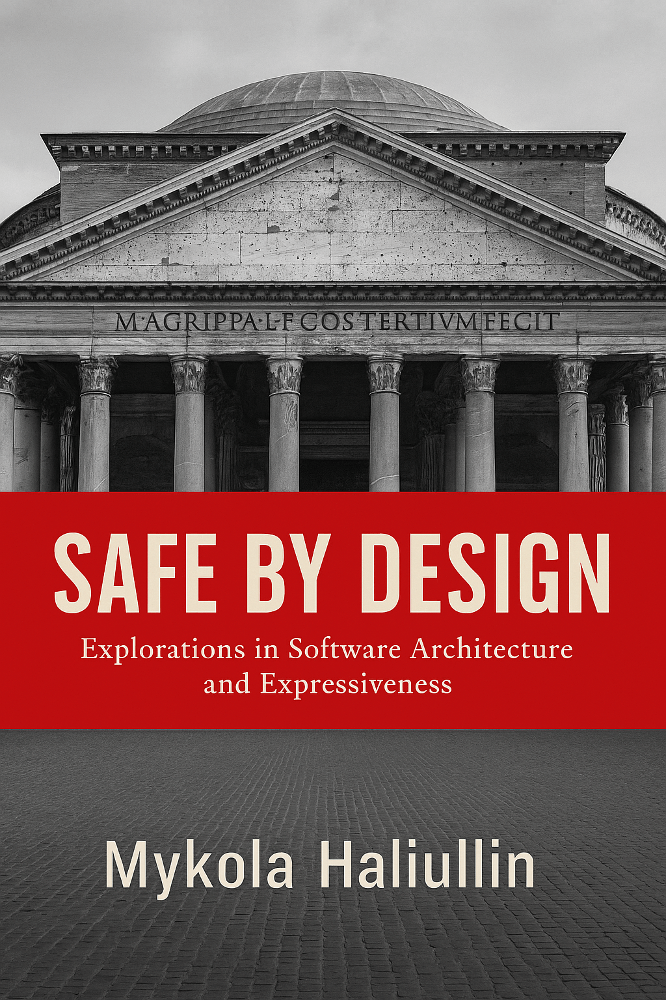

# 🛡️ Safe by Design
## Explorations in Software Architecture and Expressiveness

**A free technical book about using type systems, compile-time validation, and architectural design to write software that stays correct as it grows.**

This book is a distillation of my thoughts on the software creation process — how code evolves over time, and how we can keep it scalable, maintainable, and safe by pushing invariants to compile time instead of runtime.

---

## 📘 Read the Book

- [📄 PDF version](book.pdf)
- [📱 EPUB version](book.epub)

---

## 📚 What’s Inside

The book explores principles and techniques including:

- Building flexible systems that adapt without breaking  
- Using compile-time contracts to enforce structure
- Rethinking data validation as part of type safety
- Access modifiers as implicit interface declarations
- Separating generics in infrastructure from core architecture
- Designing systems that break loudly and early — not silently and when it’s too late

See [toc.md](toc.md) for a detailed table of contents.

---

## 🎯 Who It’s For

This book is for engineers, architects, and curious developers who:

- Think beyond runtime testing and want stronger correctness guarantees
- Care about long-term architectural integrity
- Prefer structure over duct tape

You don’t need a math degree — just an interest in reasoning clearly about software.

---

## 🧠 Why I Wrote It

I wrote this as a reflection on how modern codebases degrade, how runtime errors sneak past testing, and how the compiler can — if used properly — prevent entire categories of bugs before they even exist.

This is not a textbook. It’s a conversation between two frustrated engineers who don’t want to debug the same bug twice.

---

## 📜 License

This work is licensed under a [Creative Commons Attribution-NonCommercial-ShareAlike 4.0 International License](https://creativecommons.org/licenses/by-nc-sa/4.0/).

---

## 👤 Author

**Mykola Haliullin**  
Augmented Reality Engineer, Snap Inc.  
[LinkedIn](https://www.linkedin.com/in/nikolai-nikolai/) • [GitHub](https://github.com/SanQri) • [Medium](https://medium.com/@galiullinnikolai)

---

> _“Architecture is not about where you put the controller. It’s about what the compiler refuses to let you do wrong.”_

The opinions in this post are my own and not attributable to or on behalf of my employer
